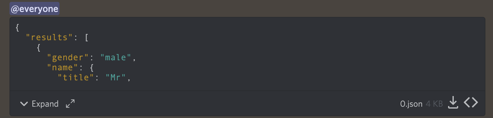

# discordbot


## 🔧 Funções

- Faz um fetch api e gera um JSON com as infos

- Envia o arquivo para o server do canal que passou

- Exclui o arquivo

- Time de execução 10800000ms millisecond) -> (10800s (second) -> 180min (minute) -> 3h (hour)



## 🚀 Instalando discordbot

```
- git clone https://github.com/rd-easy/discordbot.git

- pipe3 install requirements.txt

- python3 init.py
```

## ☕ Usando discordbot

Para usar discordbot, siga estas etapas:

```
- crie um servidor

- crie um app (bot) https://discordjs.guide/preparations/setting-up-a-bot-application.html

- adicione as variáveis de token em seu .env

- adicione o bot ao seu servidor https://docs.discord4j.com/discord-application-tutorial
  
```

## 📫 Contribuindo para discordbot

Para contribuir com discordbot, siga estas etapas:

1. Bifurque este repositório.
2. Crie um branch: `git checkout -b <nome_branch>`.
3. Faça suas alterações e confirme-as: `git commit -m '<mensagem_commit>'`
4. Envie para o branch original: `git push origin <nome_do_projeto> / <local>`
5. Crie a solicitação de pull para a branch develop.

Como alternativa, consulte a documentação do GitHub em [como criar uma solicitação pull](https://help.github.com/en/github/collaborating-with-issues-and-pull-requests/creating-a-pull-request).

<!-- ## 🤝 Colaboradores

Agradecemos às seguintes pessoas que contribuíram para este projeto:

<table>
  <tr>
    <td align="center">
      <a href="#">
        <br>
        <sub>
          <b>Iuri Silva</b>
        </sub>
      </a>
    </td>
    <td align="center">
      <a href="#">
        <br>
        <sub>
          <b>Mark Zuckerberg</b>
        </sub>
      </a>
    </td>
    <td align="center">
      <a href="#">
        <br>
        <sub>
          <b>Steve Jobs</b>
        </sub>
      </a>
    </td>
  </tr>
</table>
 -->

## 📝 Licença

Esse projeto está sob licença. Veja o arquivo [LICENÇA](LICENCE) para mais detalhes.

[⬆ Voltar ao topo](#discordbot)<br>
